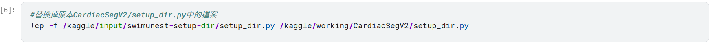
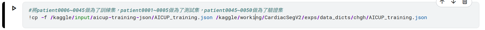

# AI CUP 2025秋季賽－電腦斷層心臟肌肉影像分割競賽 I－心臟肌肉影像分割
``AICUP_swimunest_訓練.ipynb``：模型訓練檔  
``AICUP_training.json``：資料集設定(訓練檔需要)  
``AICUP_各個模型_推論.ipynb``：模型推論檔  
``setup_dir.py``：模型位置設定檔(訓練檔需要)  
## 如何執行：
### 訓練檔：
登入kaggle平台直接執行``AICUP_swimunest_訓練.ipynb``即可，須注意  

這兩個檔案的路徑要改成你下載位置的路徑  
或是直接在以下網址中執行：https://www.kaggle.com/code/iamnn2/aicup-train-model-swimunest/edit/run/274394240  
### 測試檔：  
``AICUP_各個模型_推論.ipynb``建議直接在colab環境執行即可，如果要在kaggle端執行的話須把``/content/...``路徑改成``/kaggle/working/``路徑，或是直接在以下網址中執行：https://colab.research.google.com/drive/1WSjH1gFk4A7zcxXnIb5HntJnIOm5nHSu?usp=sharing
